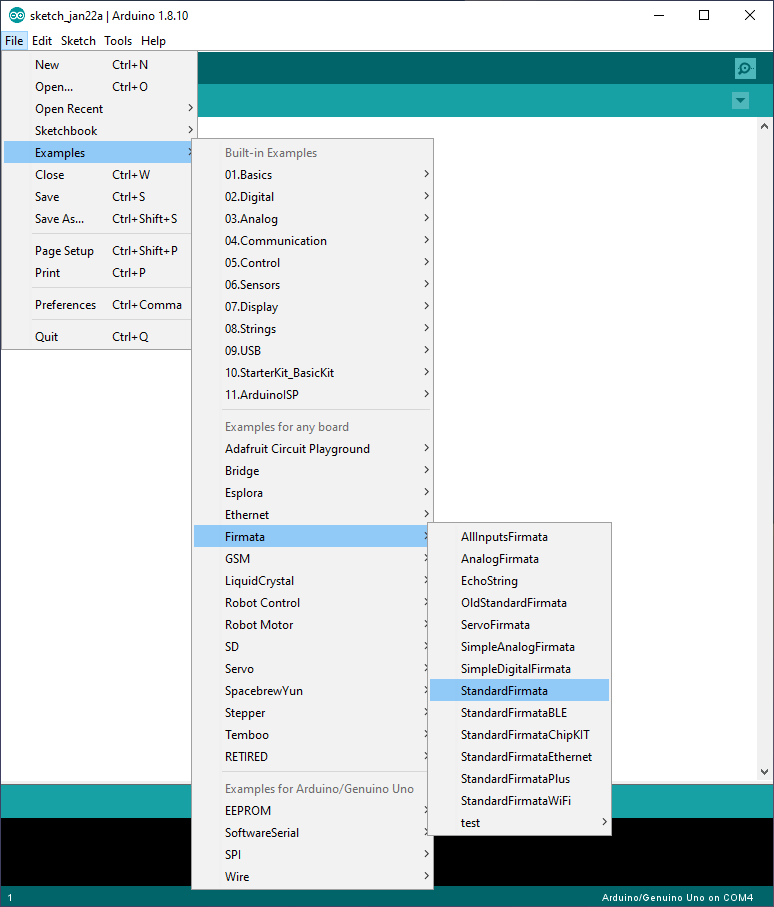

# Controller stepper motors A4988 using python
This construction of an automatic measuring station with a 3 axis scanner for ultrasonic examination of samples in transmission and reflection.

This project is stablish a connection with arduino to control 3 motors in 3 axis and is characterized for to have a module to calibrate and have more precision in the movement.

The connection is possible using pyfirmata to control the arduino nevertheless the Serial modules was implemented in the project and if possible to change change `ArduinoController.py` to `ArduinoControllerSerial.py` but it is recommend to keep as it is implemented now.
#
## Installation
This project is working with 
- `python 3.11.0`
- `pyFirmata` https://pypi.org/project/pyFirmata/
- `tkinter` https://docs.python.org/3/library/tkinter.html

### Clone project

```bash
  git clone https://github.com/ale4a/controller-stepper-motors
```

### Go to the project directory

```bash
  cd controller-stepper-motors
```

### Run StandardFirmata on your Arduino board

First you have to configure your Arduino. This is really a quick step.
Plug your Arduino to your computer with the USB cable, launch the Arduino IDE, and upload the StandardFirmata sketch to your board.



Make sure your Arduino board is selected in “Tools” > “Port”.

(Check out this StandardFirmata tutorial if you want to know more about Firmata on Arduino.)

Now that the program is uploaded, you can remove the USB cable and disconnect your Arduino.


### Install dependencies

```bash
  pip install tk
```

```bash
  pip install pyFirmata
```

### Start the project execute `index.py`


# 
## How Calibrate
If you want to calculate the axis you need to good `convert.py` and change
- positiveSlope
- positiveConstant
- ERROR_WHEN_CHANGE_DIRECTION
Getting closes to linear regression, at the moment one change will work for all axis but it is possible to change
# 
## Control Panel
You need to choose the port after that you can control every button in the panel

After that online press on button, it is necessary to wait a few minutes to establish the connection


#
## Save current position
This project save current position using `.txt` if possible to save information in EEPROM but for simplicity it was preferred to use this method
#
## Resources
This resources might be helpful if you want to modify the code

- Read docs to operation of arduino
- [Template GUI](https://runestone.academy/ns/books/published/thinkcspy/GUIandEventDrivenProgramming/03_widgets.html)
- [What is environments in VSC](https://code.visualstudio.com/docs/python/environments) 
- [EEPROM](https://docs.arduino.cc/learn/built-in-libraries/eeprom)
- [EEPROM with pyfirmata](https://arduino.stackexchange.com/questions/28971/can-you-save-data-to-eeprom-using-firmata)
# 
## Authors
[@ale4a](https://www.github.com/ale4a) Alejandro Alvarez

Thank you for the opportunity :)


